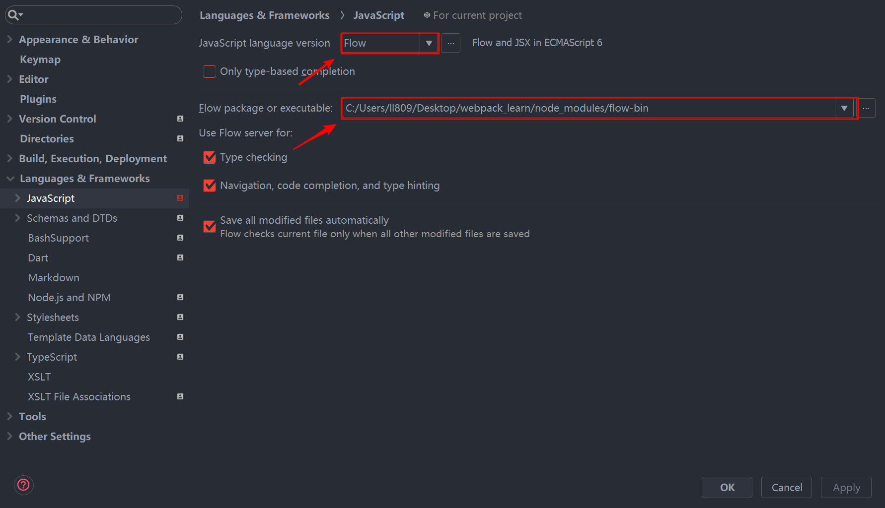

[官网](https://zhenyong.github.io/flowtype/docs/getting-started.html#_)

## Flow 学习
   1. 全局安装 flow: ``npm install -g flow-bin``
   2. 创建一个 flow-started 文件夹，然后在其内创建 index.js 文件,
      测试代码参考官网(https://zhenyong.github.io/flowtype/docs/getting-started.html#_)
   3. 创建 .flowconfig 文件: ``flow init``, 其内有一些默认的内容。
   4. index.js 内部写好测试代码，打开 git bash 进入 flow-started 文件夹内, 输入 ``flow`` 运行文件。
   5. 注释说明: 如果 index.js 内的 ``//@flow`` 去掉就不会利用 flow 检测当前文件
   6. Webstorm 中更改当前语法检查为 flow: ``File --> Setting --> Languages & Frameworks -->
      Javascript 把 Javascript language version 后改为 Flow, 下面的 flow 路径选择自动加载(前提
      是已经全局安装了 flow) ``, 也可见下图: 

### 高级配置 (https://zhenyong.github.io/flowtype/docs/advanced-configuration.html#_)
- [ignore]
    + .flowconfig 中的 [include] 一栏，用来告诉 flow 还要检测哪些文件或者目录（所有子文件）。 
       这一栏配置的每一行表示一个待检测的路径，可以使用相对于根目录的路径，或者绝对路径， 支持一个或多个星号通配符。
- [include]
    
- [libs]
    + 配置了 .flowconfig 文件的 [libs] 后，当检测代码的时候， flow 就会包含指定的 声明 (接口文件)。
    + [libs] 下每行配置表示要包含的一个目录或文件，相对与根目录的路径，或者绝对路径
- [lints]

- [options]

- [strict]

## Language reference (https://zhenyong.github.io/flowtype/docs/quick-reference.html#_)
- any 
    + any 是一种超集类型 同时 又是所有类型的子集。实际上用了 any 类型就不会检查了，如果能
      用别的类型就别用 any